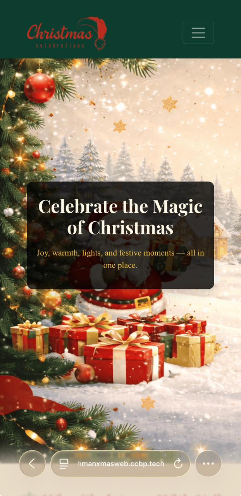
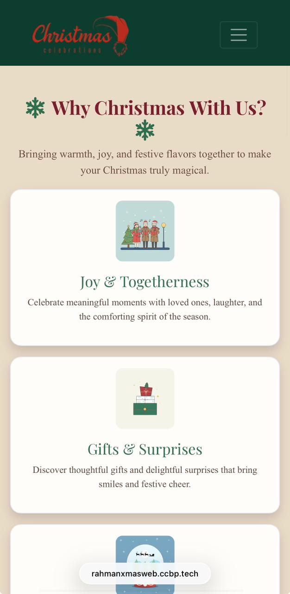
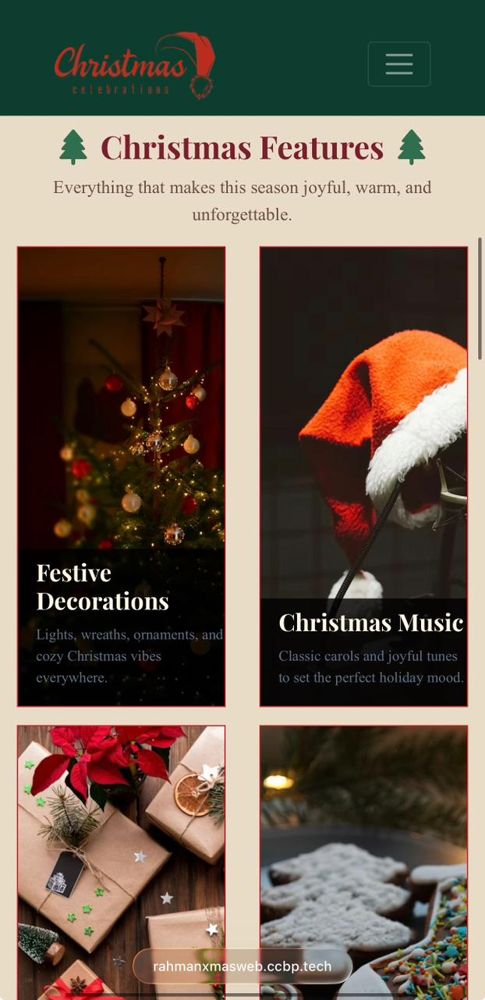
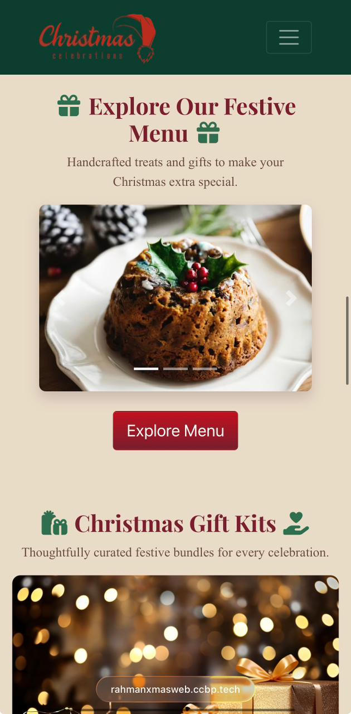

# 🎄 Christmas Celebration – Responsive Festive Website

A fully responsive Christmas-themed static website designed to celebrate the festive spirit with clean UI, smooth layouts, and structured sections. This project showcases my frontend development skills using core web technologies.

---

## 🔗 Live Demo
👉 https://rahmanxmasweb.ccbp.tech

---

## 🛠️ Tech Stack
- HTML5  
- CSS3  
- Bootstrap 4  
- Font Awesome  
- JavaScript (Bootstrap interactions)

---

## ✨ Features
- Responsive Navbar with dropdown navigation  
- Festive Hero Banner section  
- “Why Christmas?” storytelling section  
- Feature cards using Bootstrap Grid  
- Festive Menu using Bootstrap Carousel  
- Christmas Gift Kits section with popovers  
- Purchase guidance sections  
- Contact section with icons  
- Clean, responsive Footer  

---

## 📱 Responsiveness
The website is fully responsive and optimized for:
- Mobile devices  
- Tablets  
- Laptops & Desktops  

---

## 🎯 Learning Outcomes
- Hands-on experience with responsive layouts  
- Bootstrap grid system & components  
- UI structuring and section-based design  
- Practical use of Font Awesome icons  
- Building a complete static website end-to-end  

---

## 🎓 Course & Program
This project was built as part of the **CCBP Intensive 4.0 – Full Stack (MERN)** program by **NxtWave**.

---

## 🚀 How to Run Locally
1. Clone the repository  
   ```bash
   git clone https://github.com/your-username/christmas-celebration-website.git


2. Open `index.html` in your browser

---

## 📸 Screenshots

Screenshots showcasing different sections and responsiveness are included in the repository.

### Home Page


### Why Christmas Section


### Features Section


### Gift Kits Section


---

## 🎥 Website Walkthrough
Click the link below to watch a full walkthrough of the website:

🔗 [Watch Video](screen-shots/Website-Workaround.mp4)

---

## 🤝 Acknowledgements

* **NxtWave** for structured learning and mentorship
* Bootstrap & Font Awesome documentation

---

## 📬 Contact

If you’d like to share feedback or collaborate, feel free to reach out!

---

⭐ If you like this project, don’t forget to star the repository!
